# Free HTML website templates

34 static HTML/CSS templates made with
[Swebsy](https://swebsy.com), a free visual website builder. Each folder's
`site/` is a complete website: open `index.html`, or upload the folder to
GitHub Pages, Netlify, Cloudflare Pages or any static host.

Prefer to edit visually? **Edit in Swebsy** opens the template in the browser
editor, free and with no account.

### [Artup](artup/)

A polished personal portfolio template for designers and creators to showcase their work, story, process, and distinctive style.

[Live demo](https://studio.swebsy.com/templates/artup/preview/) · [Edit in Swebsy](https://studio.swebsy.com/create?template=artup&ref=github) · [Details](https://swebsy.com/templates/artup/)

### [Ember](ember/)

[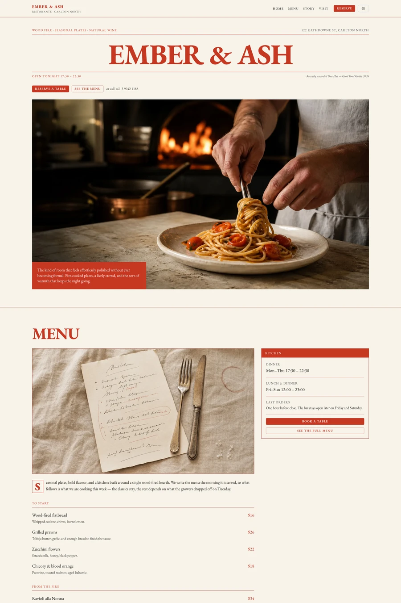](ember/)

A wood-fired restaurant site in warm paper and ember red: oversized serif display type, ruled editorial sections, priced menu lists and a booking-first call to action.

[Live demo](https://studio.swebsy.com/templates/ember/preview/) · [Edit in Swebsy](https://studio.swebsy.com/create?template=ember&ref=github) · [Details](https://swebsy.com/templates/ember/)

### [Clarity](clarity/)

[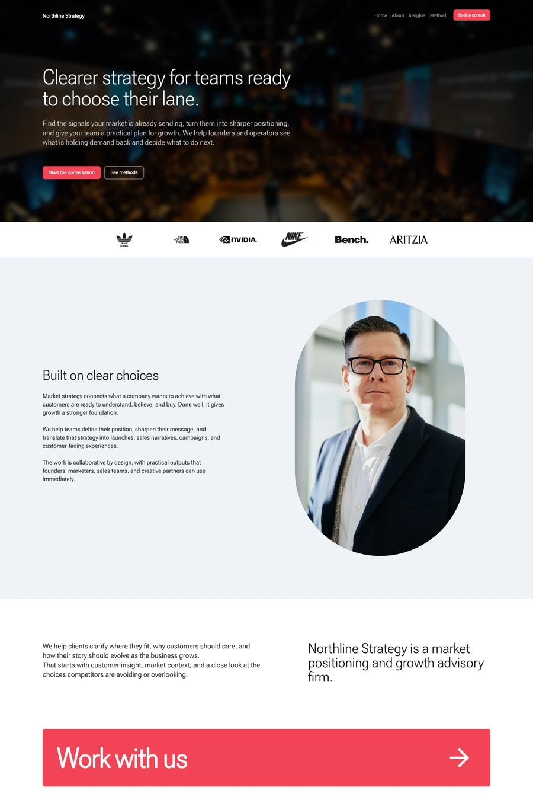](clarity/)

A polished advisory template for consultants and strategy firms to present their method, proof, workshops, and inquiry path with confidence.

[Live demo](https://studio.swebsy.com/templates/clarity/preview/) · [Edit in Swebsy](https://studio.swebsy.com/create?template=clarity&ref=github) · [Details](https://swebsy.com/templates/clarity/)

### [Marigold](marigold/)

[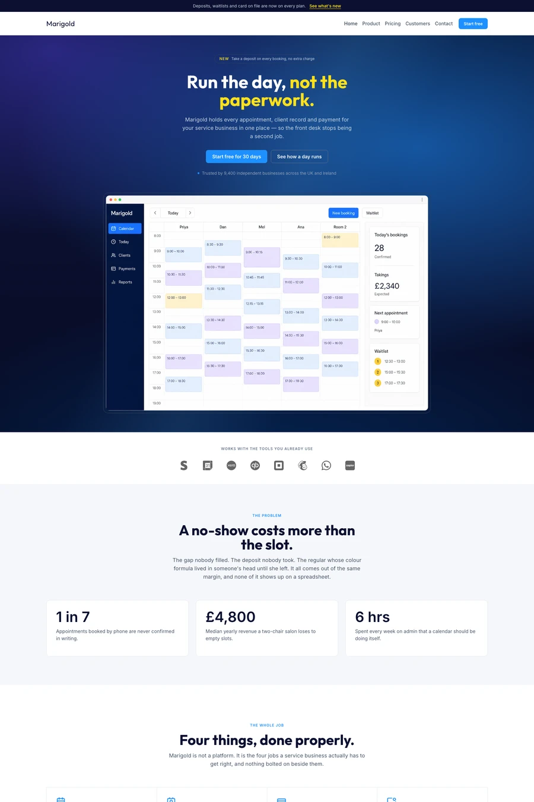](marigold/)

A crisp, high-contrast SaaS site for scheduling and practice-management products, pairing deep navy with electric blue across a product tour, pricing tiers and customer stories.

[Live demo](https://studio.swebsy.com/templates/marigold/preview/) · [Edit in Swebsy](https://studio.swebsy.com/create?template=marigold&ref=github) · [Details](https://swebsy.com/templates/marigold/)

### [Fennel](fennel/)

A calm five-page template for dental and health practices: flat pastel panels, full-bleed photo bands, plain-spoken pricing and a booking CTA on every page.

[Live demo](https://studio.swebsy.com/templates/fennel/preview/) · [Edit in Swebsy](https://studio.swebsy.com/create?template=fennel&ref=github) · [Details](https://swebsy.com/templates/fennel/)

### [Kindred](kindred/)

A warm, paper-textured template for a small immigration law practice, with flat fees, partner stories, client outcomes and a consultation form.

[Live demo](https://studio.swebsy.com/templates/kindred/preview/) · [Edit in Swebsy](https://studio.swebsy.com/create?template=kindred&ref=github) · [Details](https://swebsy.com/templates/kindred/)

### [Cindermoth](cindermoth/)

[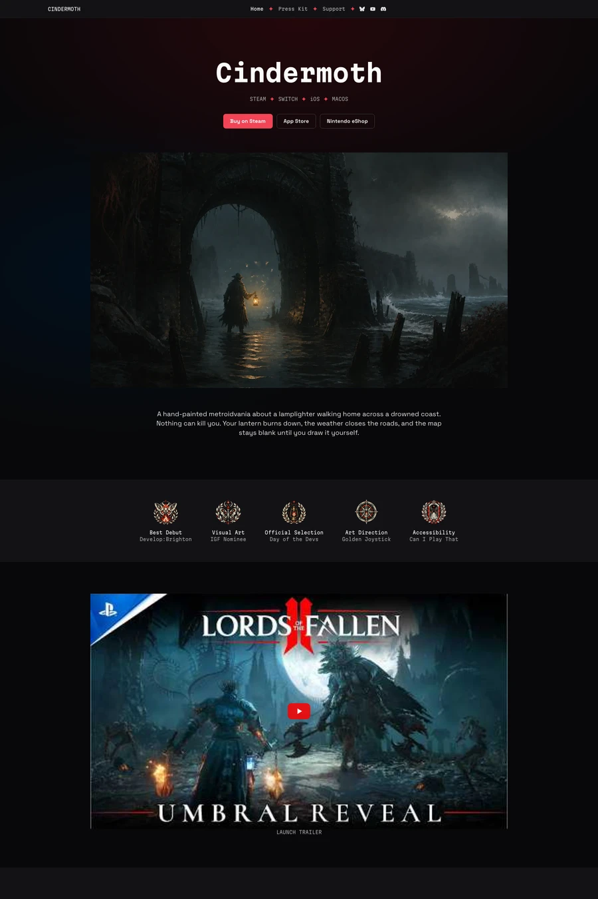](cindermoth/)

A dark editorial launch and press-kit template for indie games, with cinematic galleries, store calls to action, support resources, and legal pages.

[Live demo](https://studio.swebsy.com/templates/cindermoth/preview/) · [Edit in Swebsy](https://studio.swebsy.com/create?template=cindermoth&ref=github) · [Details](https://swebsy.com/templates/cindermoth/)

### [Craft](craft/)

[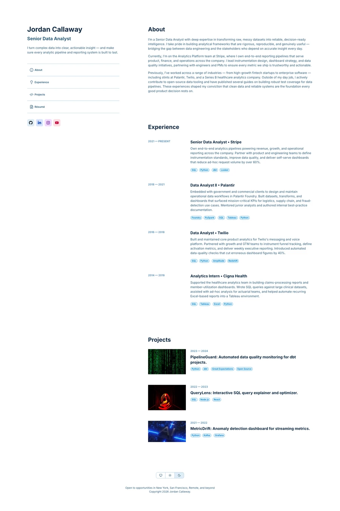](craft/)

A focused, minimal portfolio template for makers and creators who want their strongest projects and capabilities to take center stage.

[Live demo](https://studio.swebsy.com/templates/craft/preview/) · [Edit in Swebsy](https://studio.swebsy.com/create?template=craft&ref=github) · [Details](https://swebsy.com/templates/craft/)

### [Good Work](good-work/)

[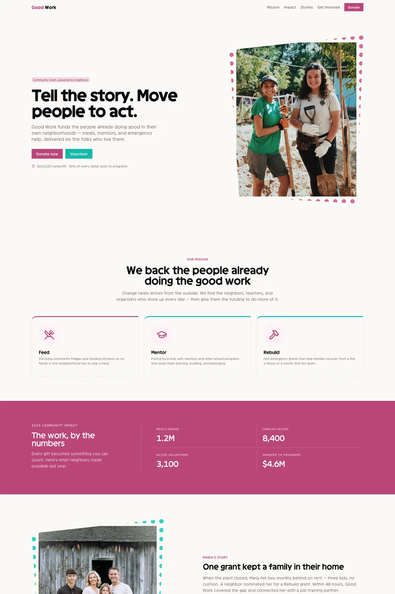](good-work/)

A bold multi-page nonprofit template for community relief, transparent impact reporting, fundraising, volunteer opportunities, and human stories.

[Live demo](https://studio.swebsy.com/templates/good-work/preview/) · [Edit in Swebsy](https://studio.swebsy.com/create?template=good-work&ref=github) · [Details](https://swebsy.com/templates/good-work/)

### [Daybreak](daybreak/)

[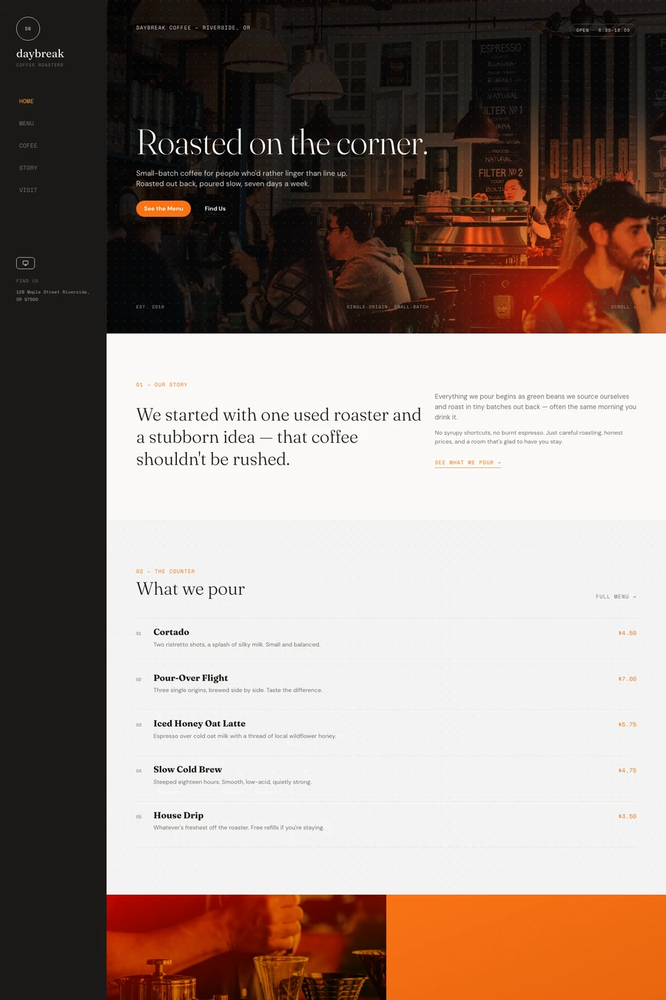](daybreak/)

An editorial, multi-page template for specialty coffee roasters, with dedicated spaces for the menu, coffee, story, and visit information.

[Live demo](https://studio.swebsy.com/templates/daybreak/preview/) · [Edit in Swebsy](https://studio.swebsy.com/create?template=daybreak&ref=github) · [Details](https://swebsy.com/templates/daybreak/)

### [Imprint](imprint/)

[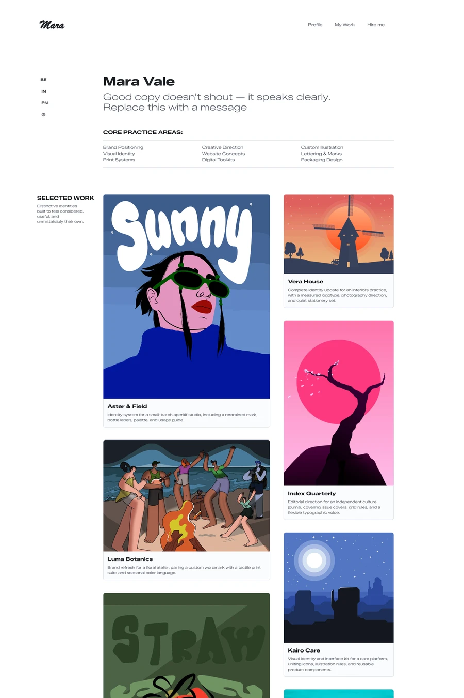](imprint/)

A refined multi-page designer portfolio for presenting identity work, creative services, client proof, and a focused inquiry path.

[Live demo](https://studio.swebsy.com/templates/imprint/preview/) · [Edit in Swebsy](https://studio.swebsy.com/create?template=imprint&ref=github) · [Details](https://swebsy.com/templates/imprint/)

### [Marquee](marquee/)

[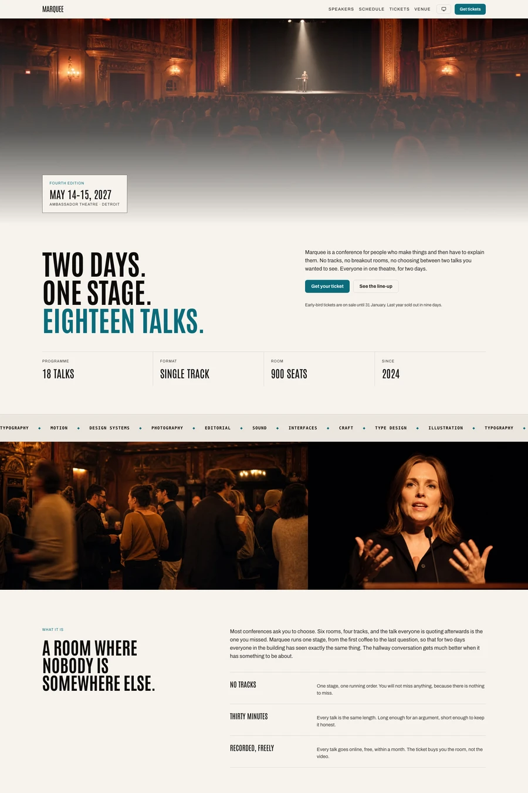](marquee/)

A photography-led conference site: full-bleed image plates, hairline-ruled schedules and ticket tiers, and a warm near-black ground that lets the pictures carry all the colour.

[Live demo](https://studio.swebsy.com/templates/marquee/preview/) · [Edit in Swebsy](https://studio.swebsy.com/create?template=marquee&ref=github) · [Details](https://swebsy.com/templates/marquee/)

### [Pulsar](pulsar/)

A dark-first product site for developer tools and B2B SaaS, with a glowing centered hero, bento feature grid, logo wall, three-tier pricing and a changelog page.

[Live demo](https://studio.swebsy.com/templates/pulsar/preview/) · [Edit in Swebsy](https://studio.swebsy.com/create?template=pulsar&ref=github) · [Details](https://swebsy.com/templates/pulsar/)

### [Morrow](morrow/)

[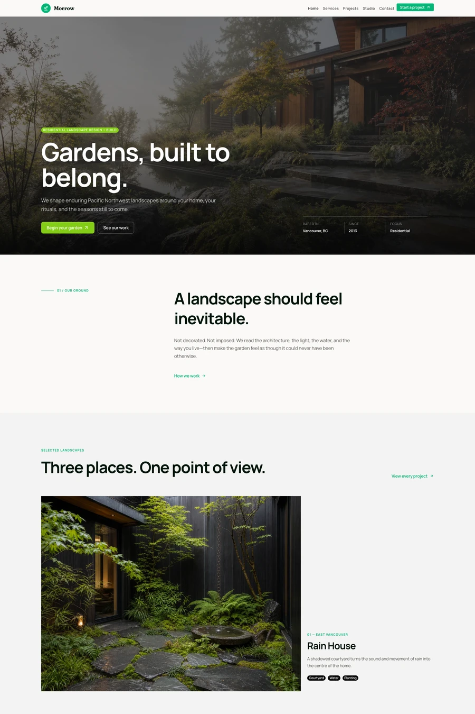](morrow/)

A premium editorial website for residential landscape design-build studios, with immersive project storytelling, services, studio profile, and direct-contact conversion.

[Live demo](https://studio.swebsy.com/templates/morrow/preview/) · [Edit in Swebsy](https://studio.swebsy.com/create?template=morrow&ref=github) · [Details](https://swebsy.com/templates/morrow/)

### [Scope](scope/)

[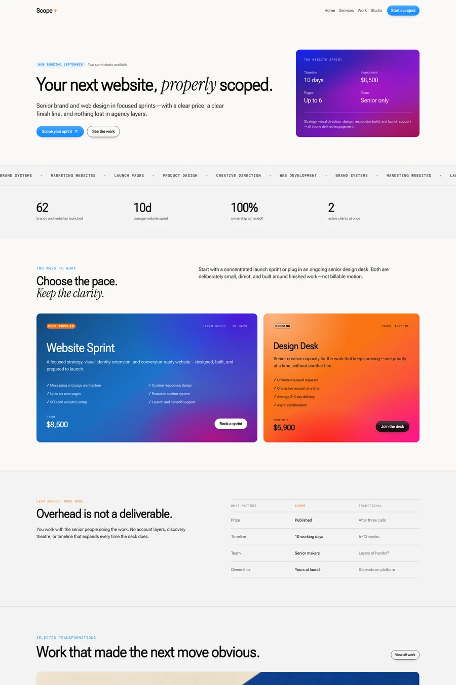](scope/)

A bold editorial studio template for fixed-scope brand and web services, with pricing, work, case study, studio, and inquiry pages.

[Live demo](https://studio.swebsy.com/templates/scope/preview/) · [Edit in Swebsy](https://studio.swebsy.com/create?template=scope&ref=github) · [Details](https://swebsy.com/templates/scope/)

### [Primer](primer/)

A two-page editorial template for a paid online course: hairline rules and a display serif instead of cards, plus a full sample lesson to give away.

[Live demo](https://studio.swebsy.com/templates/primer/preview/) · [Edit in Swebsy](https://studio.swebsy.com/create?template=primer&ref=github) · [Details](https://swebsy.com/templates/primer/)

### [Nimbus](nimbus/)

[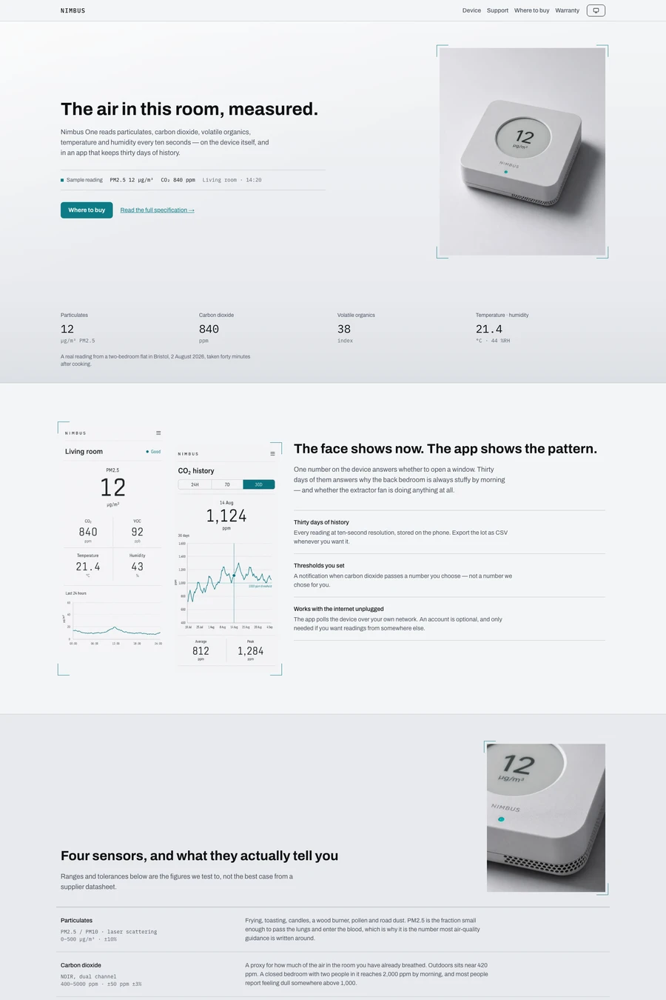](nimbus/)

An instrument-precise template for a hardware product and its app, with a full specification, a support hub with firmware release notes, a retailer directory and a warranty page.

[Live demo](https://studio.swebsy.com/templates/nimbus/preview/) · [Edit in Swebsy](https://studio.swebsy.com/create?template=nimbus&ref=github) · [Details](https://swebsy.com/templates/nimbus/)

### [Ironside](ironside/)

A bold neo-brutalist barbershop template with hard borders, offset shadows, expressive type, services, pricing, and booking details.

[Live demo](https://studio.swebsy.com/templates/ironside/preview/) · [Edit in Swebsy](https://studio.swebsy.com/create?template=ironside&ref=github) · [Details](https://swebsy.com/templates/ironside/)

### [Lume](lume/)

[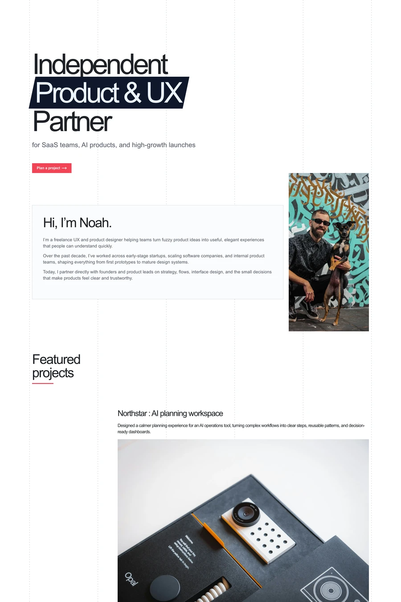](lume/)

A bright portfolio template for freelance UX and product designers to introduce their practice, selected work, services, and contact path.

[Live demo](https://studio.swebsy.com/templates/lume/preview/) · [Edit in Swebsy](https://studio.swebsy.com/create?template=lume&ref=github) · [Details](https://swebsy.com/templates/lume/)

### [Juno](juno/)

[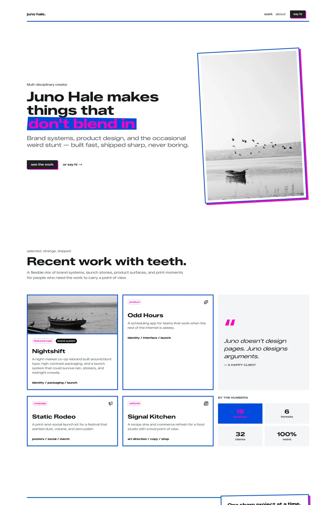](juno/)

A colorful neo-brutalist portfolio template for creative makers who want to present projects, personality, and contact details with confidence.

[Live demo](https://studio.swebsy.com/templates/juno/preview/) · [Edit in Swebsy](https://studio.swebsy.com/create?template=juno&ref=github) · [Details](https://swebsy.com/templates/juno/)

### [Varnish](varnish/)

[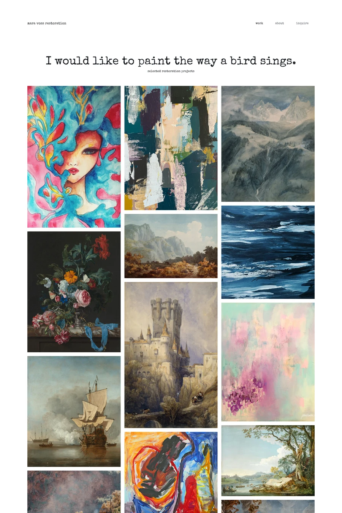](varnish/)

A refined multi-page portfolio template for artists and creative studios to frame signature work, studio context, and thoughtful inquiries.

[Live demo](https://studio.swebsy.com/templates/varnish/preview/) · [Edit in Swebsy](https://studio.swebsy.com/create?template=varnish&ref=github) · [Details](https://swebsy.com/templates/varnish/)

### [Folio](folio/)

[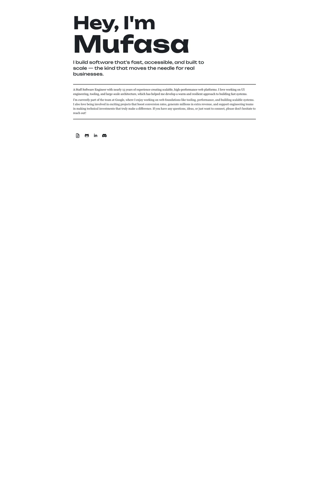](folio/)

A clean, single-page portfolio template that gives independent creators a direct way to introduce themselves and highlight selected work.

[Live demo](https://studio.swebsy.com/templates/folio/preview/) · [Edit in Swebsy](https://studio.swebsy.com/create?template=folio&ref=github) · [Details](https://swebsy.com/templates/folio/)

### [Oak](oak/)

[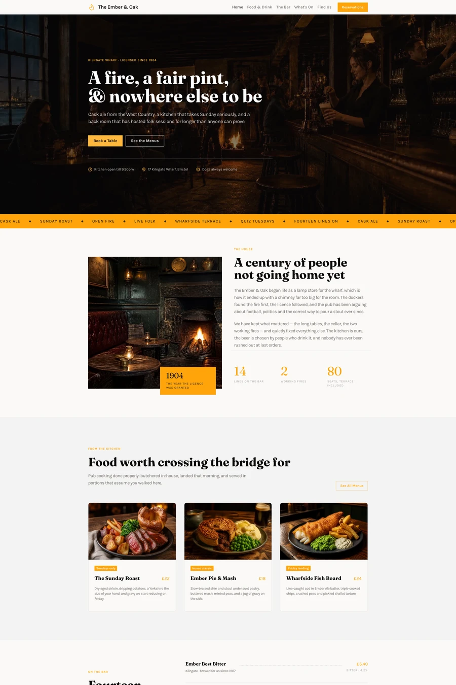](oak/)

A warm, editorial multi-page pub and dining template with rich imagery, menus, events, venue information, and external reservations.

[Live demo](https://studio.swebsy.com/templates/oak/preview/) · [Edit in Swebsy](https://studio.swebsy.com/create?template=oak&ref=github) · [Details](https://swebsy.com/templates/oak/)

### [Forge](forge/)

[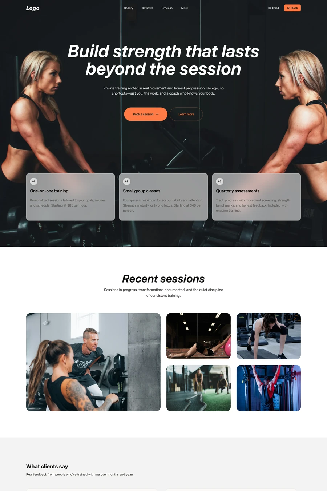](forge/)

A bold training website for coaches who build sustainable strength through real movement, honest progress, and focused one-to-one support.

[Live demo](https://studio.swebsy.com/templates/forge/preview/) · [Edit in Swebsy](https://studio.swebsy.com/create?template=forge&ref=github) · [Details](https://swebsy.com/templates/forge/)

### [Atelier](atelier/)

[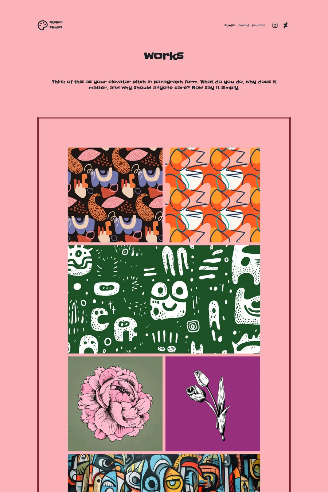](atelier/)

Showcase your work in a clean, gallery-inspired portfolio designed to let each artwork, project, and studio story speak first.

[Live demo](https://studio.swebsy.com/templates/atelier/preview/) · [Edit in Swebsy](https://studio.swebsy.com/create?template=atelier&ref=github) · [Details](https://swebsy.com/templates/atelier/)

### [Vantage](vantage/)

[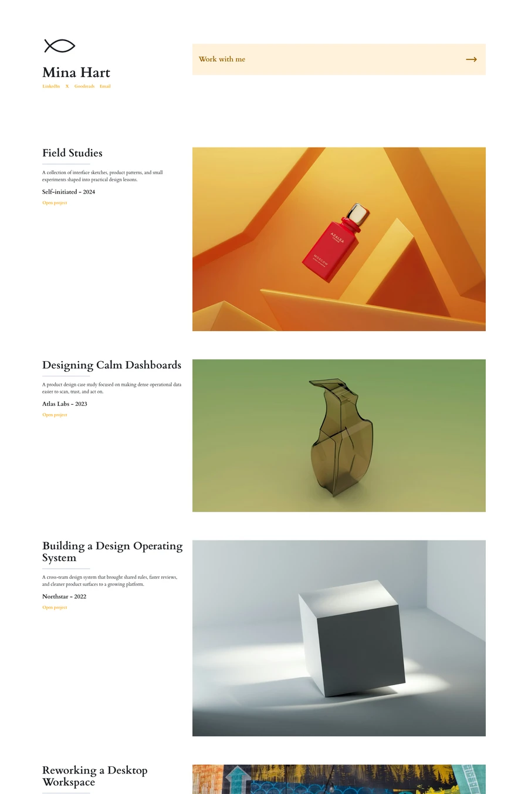](vantage/)

A bold portfolio template for product designers, creative leads, and independent consultants who want to show work and strategic range.

[Live demo](https://studio.swebsy.com/templates/vantage/preview/) · [Edit in Swebsy](https://studio.swebsy.com/create?template=vantage&ref=github) · [Details](https://swebsy.com/templates/vantage/)

### [Poplink](poplink/)

[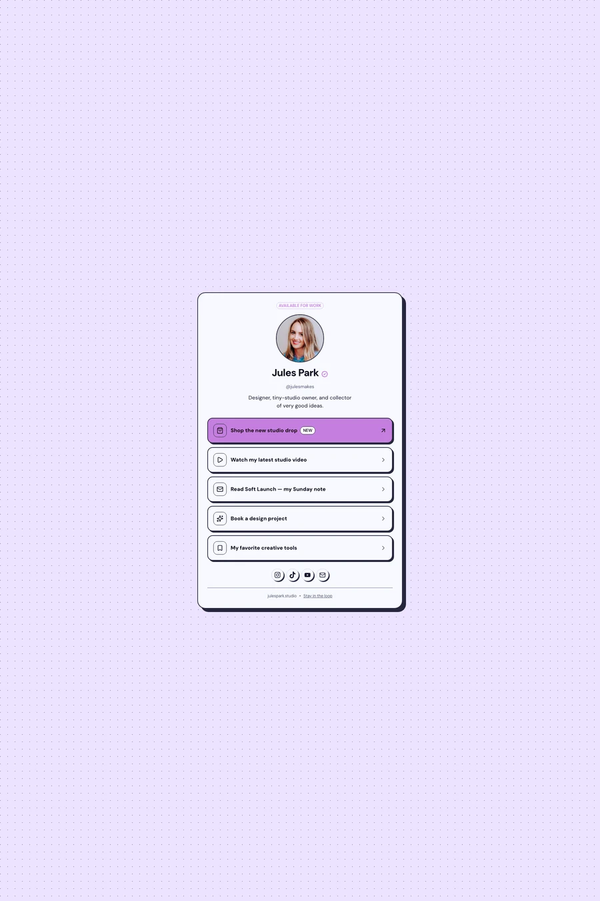](poplink/)

A bright, playful link-in-bio template that helps creators collect social profiles, featured content, and essential links on one memorable page.

[Live demo](https://studio.swebsy.com/templates/poplink/preview/) · [Edit in Swebsy](https://studio.swebsy.com/create?template=poplink&ref=github) · [Details](https://swebsy.com/templates/poplink/)

### [Linker](linker/)

A sleek link-in-bio template for collecting important links, featured highlights, social profiles, and personal brand essentials in one place.

[Live demo](https://studio.swebsy.com/templates/linker/preview/) · [Edit in Swebsy](https://studio.swebsy.com/create?template=linker&ref=github) · [Details](https://swebsy.com/templates/linker/)

### [Aurora Glass](aurora-glass-link-in-bio/)

[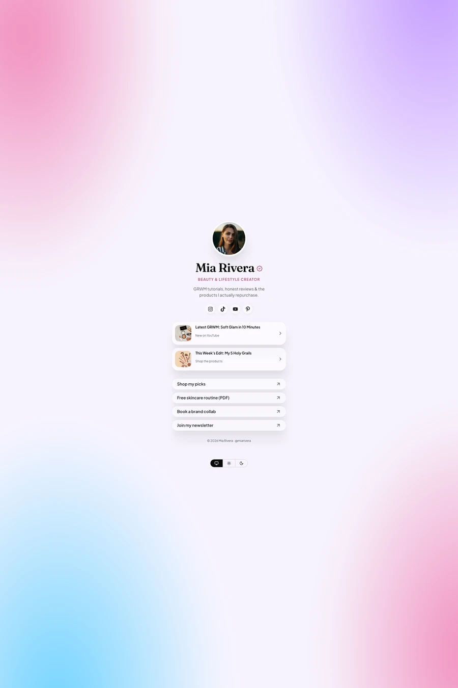](aurora-glass-link-in-bio/)

A luminous glass link-in-bio template with social links, featured media, product cards, and an animated aurora background in light and dark modes.

[Live demo](https://studio.swebsy.com/templates/aurora-glass-link-in-bio/preview/) · [Edit in Swebsy](https://studio.swebsy.com/create?template=aurora-glass-link-in-bio&ref=github) · [Details](https://swebsy.com/templates/aurora-glass-link-in-bio/)

### [Wren & Wildflower](wren-wildflower/)

[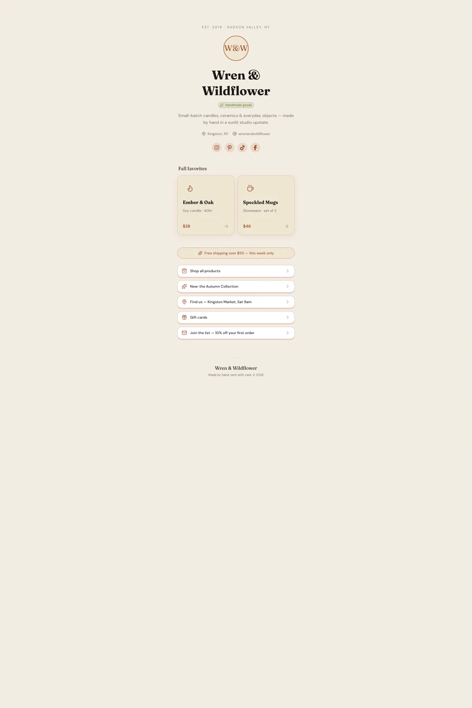](wren-wildflower/)

A warm editorial link-in-bio template for small shops and makers, with tactile link buttons, featured products, and a soft clay and sage palette.

[Live demo](https://studio.swebsy.com/templates/wren-wildflower/preview/) · [Edit in Swebsy](https://studio.swebsy.com/create?template=wren-wildflower&ref=github) · [Details](https://swebsy.com/templates/wren-wildflower/)

### [Neon Nocturne](neon-nocturne-link-in-bio/)

[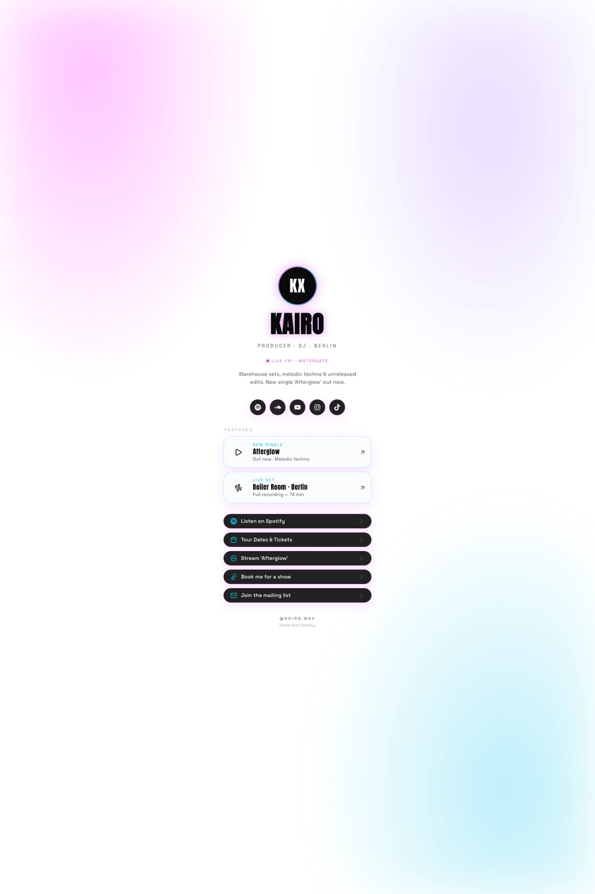](neon-nocturne-link-in-bio/)

A club-ready link-in-bio template with featured releases, live sets, social profiles, and glowing link buttons over animated neon spotlights.

[Live demo](https://studio.swebsy.com/templates/neon-nocturne-link-in-bio/preview/) · [Edit in Swebsy](https://studio.swebsy.com/create?template=neon-nocturne-link-in-bio&ref=github) · [Details](https://swebsy.com/templates/neon-nocturne-link-in-bio/)

### [Stdout](stdout/)

[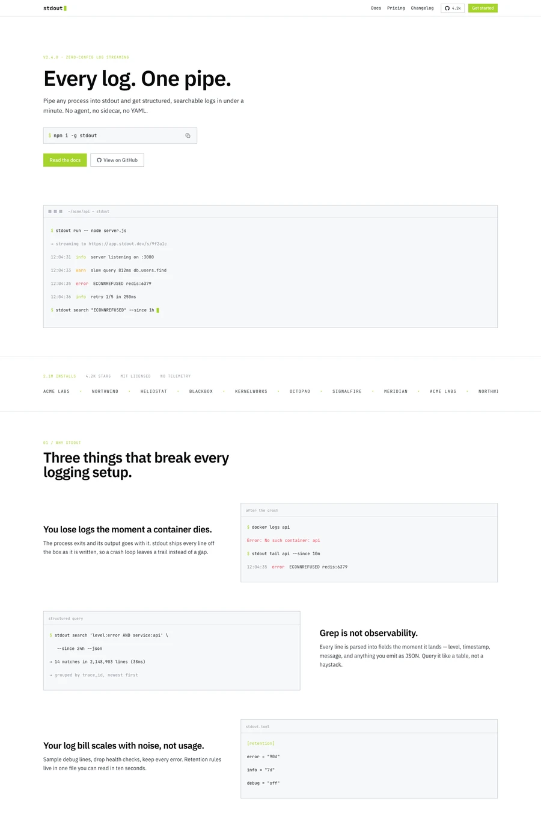](stdout/)

A dark terminal-inspired developer tool template with product storytelling, pricing, changelog, legal, and conversion pages.

[Live demo](https://studio.swebsy.com/templates/stdout/preview/) · [Edit in Swebsy](https://studio.swebsy.com/create?template=stdout&ref=github) · [Details](https://swebsy.com/templates/stdout/)

### [Booked](booked/)

[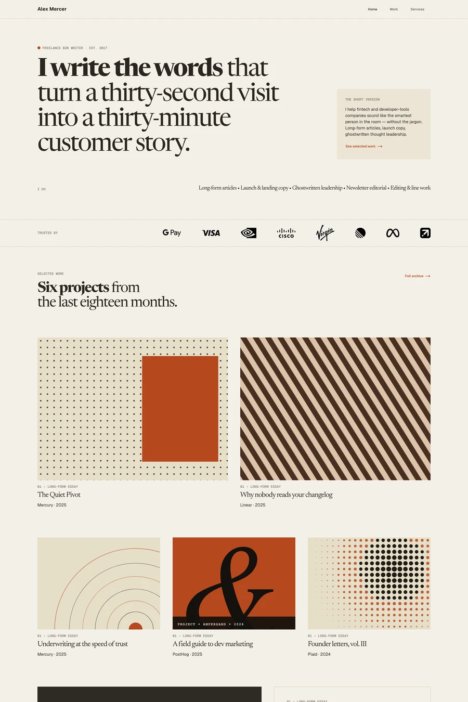](booked/)

An editorial services template for independent specialists who need to present their work, explain their offers, and turn interest into inquiries.

[Live demo](https://studio.swebsy.com/templates/booked/preview/) · [Edit in Swebsy](https://studio.swebsy.com/create?template=booked&ref=github) · [Details](https://swebsy.com/templates/booked/)

### [Compass](compass/)

[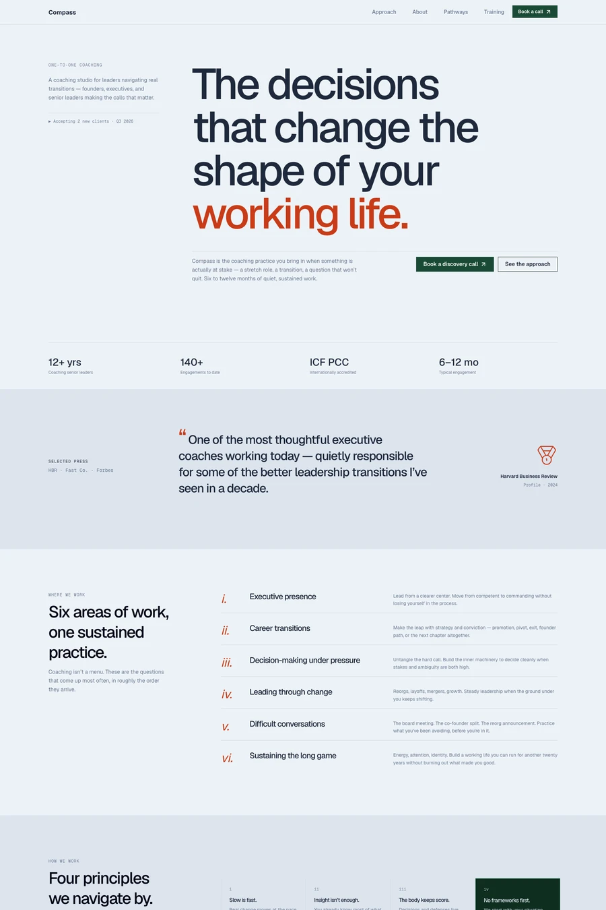](compass/)

A calm services template for executive, leadership, and career coaches to explain outcomes, compare pathways, and invite discovery calls.

[Live demo](https://studio.swebsy.com/templates/compass/preview/) · [Edit in Swebsy](https://studio.swebsy.com/create?template=compass&ref=github) · [Details](https://swebsy.com/templates/compass/)

## License

Free for any number of personal and commercial sites, changed however you like,
under the [Swebsy Free Template License](LICENSE). Two conditions:

- Keep the **"Made with Swebsy" badge** on the site as shipped. On a paid
  [Swebsy](https://swebsy.com/pricing) plan you may remove it.
- Don't redistribute or sell the templates as templates without permission.
  Linking here is always fine.

Photos keep their own licenses (mostly Unsplash and Pexels); fonts keep their
open font licenses (mostly SIL OFL).
