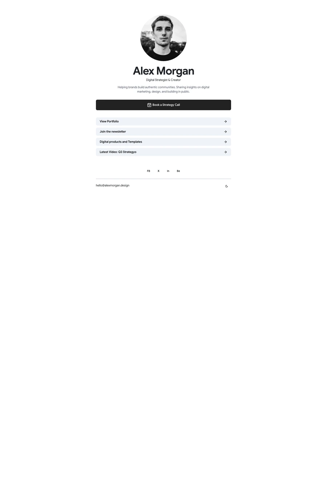

# Linker — free link in bio website template

A sleek link-in-bio template for collecting important links, featured highlights, social profiles, and personal brand essentials in one place.

Good for: Independent creators, Content professionals, Personal brands.

- [Live demo](https://studio.swebsy.com/templates/linker/preview/)
- [Edit in Swebsy](https://studio.swebsy.com/create?template=linker&ref=github), the free visual editor, no account needed
- [Template details](https://swebsy.com/templates/linker/)

## Use it

`site/` is the whole website. Open `site/index.html` locally, or upload the
folder to any static host. Replace `site/robots.txt` rules as needed and add a
sitemap once you know your domain (Swebsy writes one when you set a Site URL).

## License

Free for personal and commercial use under [CC BY 4.0](../LICENSE). The
attribution we ask for is the **"Made with Swebsy" badge**: keep it on the site
as shipped. On a paid [Swebsy](https://swebsy.com/pricing) plan you may remove
it.

Photos keep their own licenses (Unsplash, Pexels and similar, all free to
redistribute); fonts keep their open font licenses (mostly SIL OFL).
