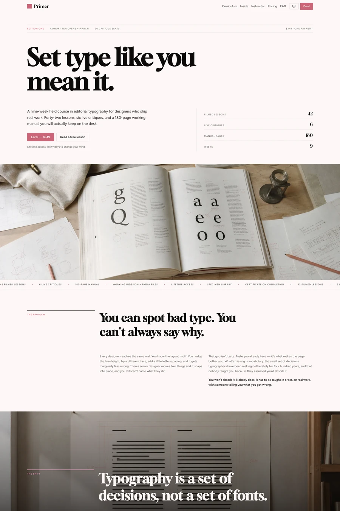

# Primer — free course website template

A two-page editorial template for a paid online course: hairline rules and a display serif instead of cards, plus a full sample lesson to give away.

Good for: Course creators, Design educators, Independent teachers.

- [Live demo](https://studio.swebsy.com/templates/primer/preview/)
- [Edit in Swebsy](https://studio.swebsy.com/create?template=primer&ref=github), the free visual editor, no account needed
- [Template details](https://swebsy.com/templates/primer/)

## Use it

`site/` is the whole website. Open `site/index.html` locally, or upload the
folder to any static host. Replace `site/robots.txt` rules as needed and add a
sitemap once you know your domain (Swebsy writes one when you set a Site URL).

## License

Free for any number of personal and commercial sites, changed however you like,
under the [Swebsy Free Template License](../LICENSE). Two conditions:

- Keep the **"Made with Swebsy" badge** on the site as shipped. On a paid
  [Swebsy](https://swebsy.com/pricing) plan you may remove it.
- Don't redistribute or sell the templates as templates without permission.
  Linking here is always fine.

Photos keep their own licenses (mostly Unsplash and Pexels); fonts keep their
open font licenses (mostly SIL OFL).
